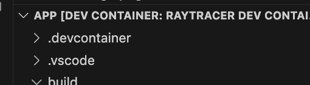
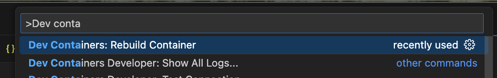
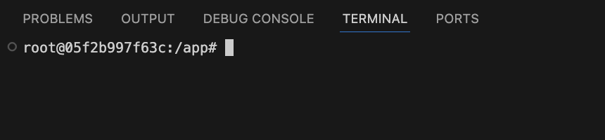
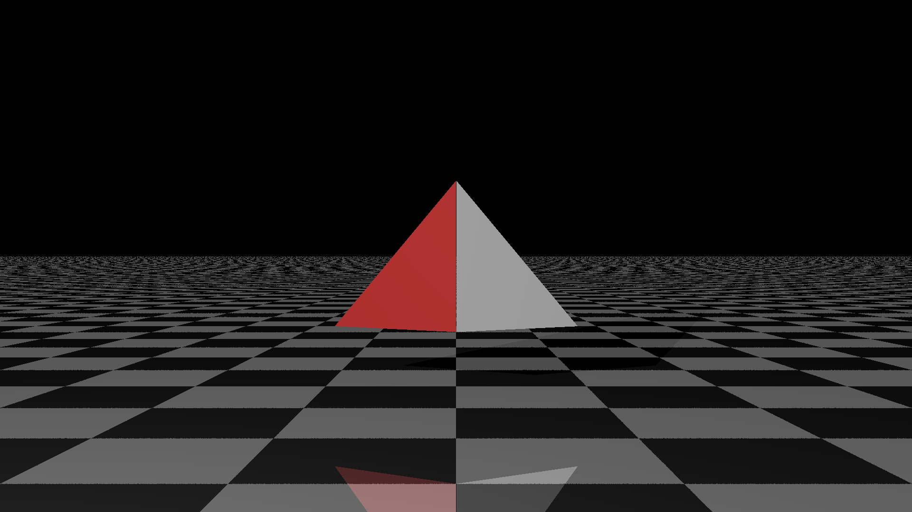
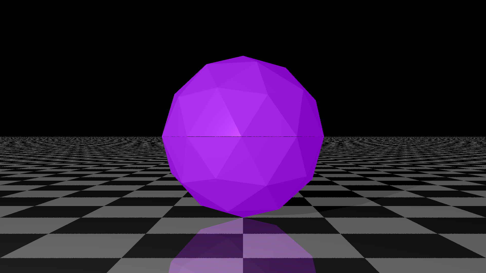
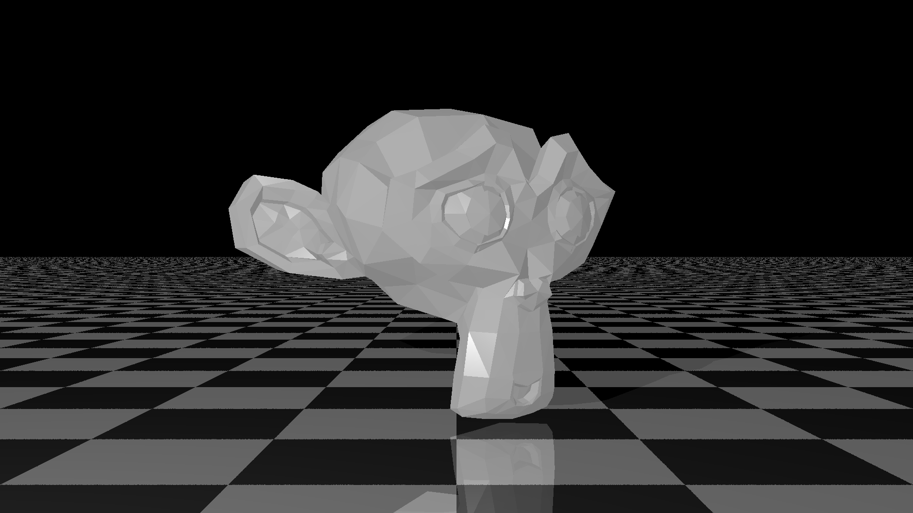
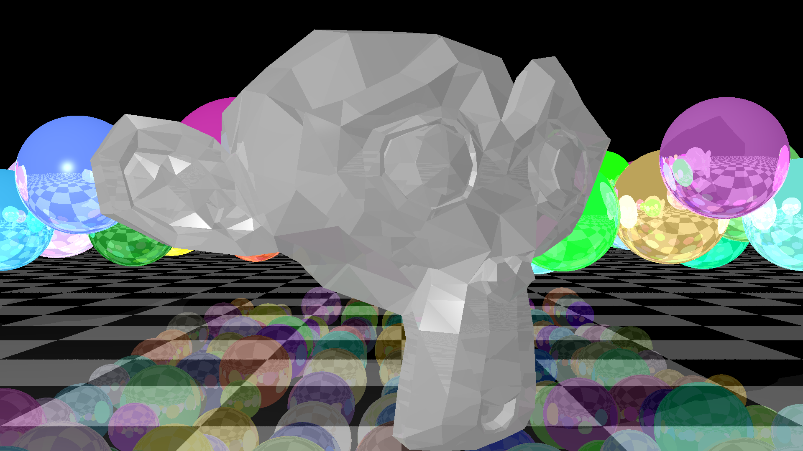

# Optimisation sample - inefficient raytracer

A basic unoptimised ray-tracer to be used as an example for Optimisation.

This project can be most easily executed on any platform using Docker and VSCode DevContainers.

## VSCode DevContainer

1. [Install Docker](https://www.docker.com)
2. [Install VSCode](https://code.visualstudio.com)
3. In VSCode, install the extension [Dev Containers](https://marketplace.visualstudio.com/items?itemName=ms-vscode-remote.remote-containers)
4. Open this project inside VSCode (the `.devcontainer` directory must be at the root of the project for the Dev Container to be recognised)



5. Press `F1`, in the context menu type `Dev Cont`... and in the proposed options, choose "Rebuild Container".



6. VSCode will restart, building the Docker Image and starting the container.
7. If the build fails, you may need to :
  7.1 Consult the error logs to resolve the build problem on your platform
  7.2 Switch to a different network (the school's network might be blocked or limited)
8. If all goes well, you can open a new terminal in VSCode. The prompt should read `root@....:/app`:



## Build and run

Navigate into the `build` directory:

```bash
cd build
```

Run `cmake` to create the build configuration:

```bash
cmake ..
```

Build the raytracer:

```bash
make
```

Run the raytracer:

```bash
./raytracer 
```

## Adding/modifying the project

Each time you modify the project structure by adding a new class to compile, adding a compile option, etc. you need to update the build configuration by running:

```bash
cmake ..
```

## Running the raytracer

The raytracer uses an input JSON file (as the first argument) to specify the scene to be rendered.

You can either specify the path of the output file as the second argument. Otherwise the generated file is `image.png`.

The following examples are provided in the the folder `scenes`.

### Two spheres on a plane

```bash
./raytracer ../scenes/two-spheres-on-plane.json 
```


### Two triangles on a plane

```bash
./raytracer ../scenes/two-triangles-on-plane.json 
```



### Sphere galaxy on a plane

```bash
./raytracer ../scenes/sphere-galaxy-on-plane.json 
```


### Sphere mesh on a plane

```bash
./raytracer ../scenes/iso-sphere-on-plane.json    
```



### Monkey mesh on a plane

```bash
./raytracer ../scenes/monkey-on-plane.json     
```



### Combined scene

```bash
./raytracer ../scenes/all.json   
```

